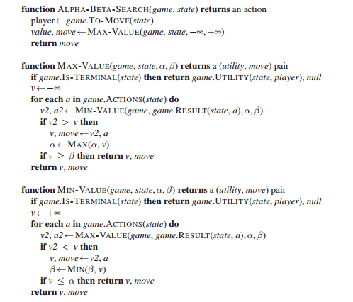

# Introduction to Adversarial Search

Adversarial search is a type of search algorithm used in game theory to find the
optimal move for a player in a game where the outcome depends on the moves of
multiple players. In adversarial search, the algorithm considers the possible
moves of both players and tries to find the best move for the current player
while assuming that the opponent will make the best possible move for
themselves.

Adversarial search algorithms are commonly used in games such as chess,
checkers, and Go, where the outcome of the game depends on the moves of both
players. These algorithms use heuristics to evaluate the utility of a game state
and search through the game tree to find the optimal move.

**Main Topics**

1. Advesarial Search
2. Minimax Algorithm
3. Alpha-Beta Pruning
4. Evaluation Functions
5. Isolation Game Player
6. Multiplayer, Probabilstic Games

# Lesson: Search in Multi-agent Domains

- The MINMAX algorithm
- Isolation
- MIN and MAX levels
- Propagating values up the tree
- Computing MIN MAX values
- Choosing the best branch
- Max number of nodes
- The branching factor

## The MINIMAX Algorithm

The minimax algorithm is a recursive algorithm. It explores the game tree by
recursively evaluating the utility values of different game states.

The algorithm starts at the root node and considers all possible moves that the
active player can make. For each possible move, it recursively calls itself to
evaluate the utility values of the resulting game states. This process continues
until it reaches a terminal state, where the game is over and a utility value
can be assigned.

During the recursive process, the algorithm alternates between the "Max" and
"Min" players, maximizing and minimizing the utility values, respectively. The
algorithm assumes that both players will make optimal moves to maximize or
minimize the utility value, depending on their role.

By evaluating the utility values of different game states and propagating them
up the tree, the minimax algorithm determines the best move for the active
player at the root node.

## Pseudo code

The psuedo code for minimax is shown in Figure \ref{fig:minimax}:

## A Python Implementation

Note that this is a recursive algorithm. The `minimax_decision` function calls
the `min_value` and `max_value` functions, which in turn call each other. Also
note in the min_value and max_value functions, the `gameState.result(a)` is
passed as an argument to the `min_value` and `max_value` functions. This is how
the algorithm traverses the game tree.

In the `minimax_decision` function we are checking all possible moves/actions
and returning the one with the highest value. This is the move that the active
player should make. Note that you pass the result of the action,
`gameState.result(a)`, to the `min_value` function to get the value of each
move. Here we are just using a mapping function (using the lambda function) to
get the value of each move.

        def minimax_decision(gameState):
            """ Return the move along a branch of the game tree that
            has the best possible value.  A move is a pair of coordinates
            in (column, row) order corresponding to a legal move for
            the searching player.
            
            You can ignore the special case of calling this function
            from a terminal state.
            """
            # The built in `max()` function can be used as argmax!
            return max(gameState.actions(),
                       key=lambda m: min_value(gameState.result(m)))

        def min_value(gameState):
            """ Return the game state utility if the game is over,
            otherwise return the minimum value over all legal successors
            """
            if gameState.terminal_test():
                return gameState.utility(0)
            v = float("inf")
            for a in gameState.actions():
                v = min(v, max_value(gameState.result(a)))
            return v
    
    
        def max_value(gameState):
            """ Return the game state utility if the game is over,
            otherwise return the maximum value over all legal successors
            """
            if gameState.terminal_test():
                return gameState.utility(0)
            v = float("-inf")
            for a in gameState.actions():
                v = max(v, min_value(gameState.result(a)))
            return v

## Isolation (5x5)

Watch this video link: [https://www.youtube.com/watch?v=n_ExdXeLNTk](https://www.youtube.com/watch?v=n_ExdXeLNTk)

We need to create a `GameState` class with the ability to:

1. keep track of which cells are open and closed
2. identify which player has initiative (whose turn it is to move)
3. track the current position of each player on the board

## Propagating Values Up the Tree

The minimax algorithm propagates the utility values up the tree by alternating between the "Max" and "Min" players. The algorithm assumes that both players will make optimal moves to maximize or minimize the utility value, depending on their role.

The Figure \ref{fig:propagate} shows the propagation of values up the tree:

Notes:

- an "Up" arrow indicates a MAX node
- a "Down" arrow indicates a MIN node
- To begin with, boxes E, F, G, H, I, and J have just one child. As such, they
  simply take the value of their child.
- Box C is a minimizer node, and hence chooses the minimum of boxes F, and G
  which is G's value of -1.
- Box A is a maximizing node, and chooses the maximum of boxes B, C, and D which
  is D's value of +1.

## Number of nodes

The number of nodes that need to be explored is exponential with depth of the
tree. The average branching factor is the number of children each node has on
average over the course of the game. In other words, it represents how many
possible moves there are at each turn.

The number of nodes that need to be explored is the average branching factor
raised to the power of the depth of the tree. If $b$ is the average branching
factor and $d$ is the depth of the tree, then the number of nodes that need to
be explored is $b^d$.

For a `5x5` Queens isolation game you have an average branching factor of around
8 and a depth of 25. This means that the number of nodes that need to be
explored is $8^{25}$ which is around $10^{22}$. Given a processor that could
compute $10^{9}$ calculations per second, we would need to wait around 1.2
million years to get our answer.

# Lesson: Optimizing Minimax Search

- Depth-limited search
- Evaluation function
- Testing the evaluation function
- Quiescent search
- Iterative deepening
- Varying the branching factor
- Horizon effect
- Alpha-Beta pruning

## Depth-limited Search

Depth-limited search is a variation of the minimax algorithm that limits the
depth of the game tree that is explored. This is done by adding a depth limit
parameter to the `minimax_decision` function. The depth limit parameter
specifies the maximum depth of the game tree that should be explored and is
passed to the `min_value` and `max_value` functions. These functions check if
the depth limit has been reached and return the value of the evaluation function
if it has.

Suppose that the agent has a time limit to make a decision on its next move of
the game. If we know that the algorithm can compute $10^9$ nodes per second and
we have a time limit of 2 seconds, then we would be able to compute $2x10^9$
nodes in 2 seconds. To find the depth limit we can use the following formula:

$b^d < 2\!\times\! 10^9$

For a `5x5` Queens isolation game you have an average branching factor of around
8. This means that the depth limit is around 10.

$8^d < 2\!\times\! 10^9$

$log_8(8^d) < log_8(2\!\times\! 10^9)$

$d < log_8(2\!\times\! 10^9)$

Note that:

$log_a(x) < \frac{log_b(x)}{log_b(a)}$

So the formula becomes:

$x < \frac{log_{10}(2\times 10^9)}{log_{10}(8)} = 10.3$

In this example, the depth limit would be 10.

## Evaluation Functions

An evaluation function (also called a heuristic function) is a function that
estimates the utility value of a game state. It is analogous to a fitness metric
or objective function. The evaluation function is used to evaluate non-terminal
game states and determine which is the best move for the active player.

An example evaluation function for the `5x5` Queens isolation game would be "the
number of moves available to the active player".

Figure \ref{fig:eval} shows the evaluation function for the a simple `2x3` game.

At this point the minimax code has been modified as follows:

        player_id = 0
        
        def my_moves(gameState):
            """ Returns the number of moves available for the player_id 
            at their current location.
            """
            loc = gameState._player_locations[player_id]
            return len(gameState.liberties(loc))
          
        
        def minimax_decision(gameState, depth):
            """ Return the move along a branch of the game tree that
            has the best possible value.  A move is a pair of coordinates
            in (column, row) order corresponding to a legal move for
            the searching player.
            
            You can ignore the special case of calling this function
            from a terminal state.
            """
            best_score = float("-inf")
            best_move = None
            for a in gameState.actions():
                # call has been updated with a depth limit
                v = min_value(gameState.result(a), depth - 1)
                if v > best_score:
                    best_score = v
                    best_move = a
            return best_move
        
        
        def min_value(gameState, depth):
            """ Return the value for a win (+1) if the game is over,
            otherwise return the minimum value over all legal child
            nodes.
            """
            if gameState.terminal_test():
                return gameState.utility(0)
            
            # TODO: New conditional depth limit cutoff
            if depth <= 0:  # "==" could be used, but "<=" is safer 
                return my_moves(gameState)
            
            v = float("inf")
            for a in gameState.actions():
                # the depth should be decremented by 1 on each call
                v = min(v, max_value(gameState.result(a), depth - 1))
            return v
        
        
        def max_value(gameState, depth):
            """ Return the value for a loss (-1) if the game is over,
            otherwise return the maximum value over all legal child
            nodes.
            """
            if gameState.terminal_test():
                return gameState.utility(0)
            
            # TODO: New conditional depth limit cutoff
            if depth <= 0:  # "==" could be used, but "<=" is safer 
                return my_moves(gameState)
            
            v = float("-inf")
            for a in gameState.actions():
                # the depth should be decremented by 1 on each call
                v = max(v, min_value(gameState.result(a), depth - 1))
            return v

## Queiescent Search

Note tha the evaluation function can vary quite a bit depending on the depth
factor or limit imposed. For example, the number of moves remaining will be very
different near the root of the three than near the bottom of the tree. To know
if you are searching "deep enough" you can check if the results are varying
widely between levels. So you might set your depth limit based on the fact that
the evaluation function is no longer changing (or not widely) between levels.

We don't have to play quiescent search all the time, since it is costly, but it
may be a good idea to play it near the beginning or near the end of the game.

## Iterative Deepening

Iterative deepening is a variation of depth-limited search that gradually
increases the depth limit until a terminal state is found. This is done by
repeatedly calling the `minimax_decision` function with an increasing depth
limit until a terminal state is found.

Iterative deepening is useful when the depth of the game tree is unknown. It is
also useful when the time limit is unknown or when the time limit is very short.
In these cases, iterative deepening can be used to explore the game tree as much
as possible within the time limit.

The idea is get an answer for level 1 and keep it just in case you run out of
time. Then go to level 2 and so on. If you run out of time you can use the
answer from the last level searched to completion.

Here are a few more resources to further your understanding of Iterative Deepening:

- University of British Columbia's
  **[slides](https://www.cs.ubc.ca/~hutter/teaching/cpsc322/2-Search6-final.pdf)**
  introducing the topic.
- 3.4.5 of Russel, Norvig textbook
- A set of **[videos](https://movingai.com/dfid.html)** showing visually how
  Iterative Deepening is different from DFS in practice.

The main difference between iterative deepening depth-first search and breadth
first search is that BFS stores the state (responses) of each visited node in
memory, whereas IDDF revisits previous nodes multiple times, but only stores the
state of the current node in memory. Each iteration of iterative deepening
search generates a new level, in the same way that breadth- first search does,
but breadth-first does this by storing all nodes in memory, while
iterative￾deepening does it by repeating the previous levels, thereby saving
memory at the cost of more time. In an iterative deepening search, the nodes on
the bottom level (depth d) are generated once, those on the next-to-bottom level
are generated twice, and so on, up to the children of the root, which are
generated d times. Unlike BFS, iterative deepening allows you to set a depth
limit of more than one level, which is useful if you have the time.

**Idea:** I suppose you could use BFS with a depth limit of more than 1.
Converserly, you could to IDDF while storing the results. In other words, you
could still store the state values of the nodes so that you do not need to
revisit them.

The Figure \ref{fig:iterative} shows the iterative deepening search and counts
the number of nodes in the tree as well as the number of nodes visited by the
iterative deepening search.

The general formula for the number of nodes in the tree is:

$n = \frac{k^{d+1} - 1}{k-1}$

where:

- $k$ is the average branching factor
- $d$ is the depth of the tree
- $n$ is the number of nodes in the tree at the given depth (or level)

**Strategy:** In a game in which your total time is limited, such as speed
chess, it may be wise to vary the depth limit based on the amount of time
remaining. For example, you might set the depth limit to 1 when you have 10
seconds remaining, and set the depth limit to 2 when you have 20 seconds
remaining. This would allow you to explore the game tree as much as possible
within the time limit. The branching factor will also vary during a game
(usually higher at the beginning then at the end). As such, it may be wise to
search less deep at the beggingn of the game and deeper at the end of the game.
Or perhaps you search less deep (or through a catalogue of standard moves) at
the beginning of the game, most deep in the middle, then less deep at the end
relying on the fact that the branching factor will be smaller. 

## Alpha-Beta Pruning

Alpha-beta pruning is a variation of the minimax algorithm that eliminates the
need to explore subtrees of moves which are guaranteed to be worse than the best
move found so far. This is done by keeping track of two values, alpha and beta,
which represent the minimum score that the maximizing player is assured of and
the maximum score that the minimizing player is assured of, respectively. It
does not change the final answer but it it more efficient than minimax.

Recall that the minimax algorithm switches at each level between minimizing and
maximizing. For example, suppose the root node (level 0) takes the **min** from
level 1, then level 1 will take the **max** from level 2. So if we are doing depth first search and the left most branch at level 1 takes on a value of say 2 (the max from its children nodes) then in any following nodes at level 1, there is no need to search all of the children in level 2. As soon as any level 2 gives a value of 2, we know there is no need to keep maximizing. Ultimately, level 0 will be taking the min from level 1 anyway, so even if level 1 returned a higher value in another one of its nodes, the level 0 minimizer, will still take 2 as the its value.

Figure \ref{fig:alpha-beta} shows an example of the alpha-beta pruning approach.

Alpha-beta pruning can reduce the computational cost significantly! The typical cost is on the order of $O(b^{d})$ for minimax, $O(b^{d/2})$ for alpha-beta pruning (optimal ordering) and $O(b^{3d/4})$ for random ordering.

### Pseudo-code

Figure \ref{fig:alpha-beta-pseudo} shows the pseudo-code for the alpha-beta pruning algorithm.

Alpha-beta pruning modifies the minimax algorithm by introducing two new
variables: α -- the maximum lower bound of the minimax value -- and β -- the
minimum upper bound of the minimax value. In other words: at every state in the
game tree α represents the guaranteed worst-case score that the MAX player could
achieve, and β represents the guaranteed worst-case score that the MIN player
could achieve.

The estimates of α are only updated in each MAX node, while β is only updated in
each MIN node. If the estimate of the upper bound is ever lower than the
estimate of the lower bound in any state, then the search can be cut off because
there are no values between the upper and lower bounds. Practically this means
that your agent could do better by making a different move earlier in the game
tree to avoid the pruned state.

Implementing alpha-beta pruning in minimax only adds the two new variables
(alpha & beta), and adds a conditional branch to the MIN and MAX nodes to break
and return the appropriate bound when a state is pruned. (See the pseudocode
above & compare with the minimax algorithm.)

There's one more difference you'll notice between minimax and alpha-beta: the
alpha-beta search function seems to call the max_value()helper from the root
node, while minimax calls the min_value()helper. But the pseudocode for
alpha-beta search is just hiding some additional complexity: calling max_value()
returns the score of the best branch -- but it doesn't tell you what the best
branch is. You can implement the algorithm just like the minimax-decision
function if you modify it to update alpha between branches.

 \newpage \center{--- The End ---}